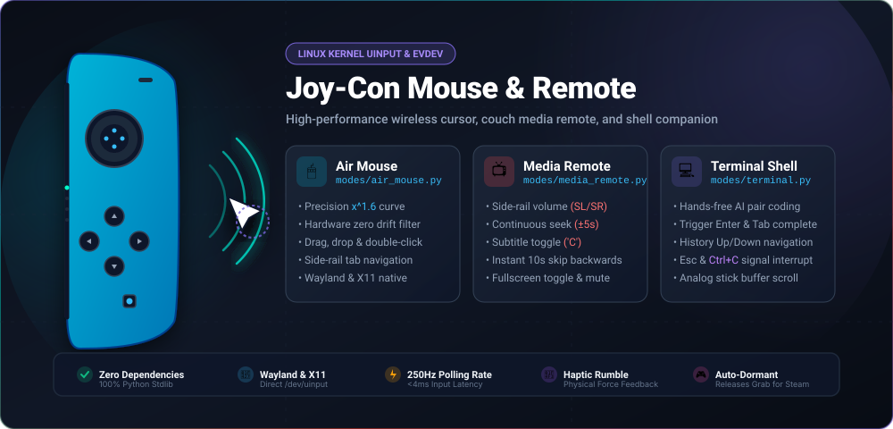

<div align="center">

# 🎮 Joy-Cons & Gamepads | Universal Controller Mouse for Windows

[](LICENSE)
[](https://www.python.org/downloads/)
[](#-quick-start-for-windows)
[](https://github.com/ImNotMrReaper/joycon-mouse/actions/workflows/ci.yml)
[](https://github.com/ImNotMrReaper/joycon-mouse/tree/windows)
[](CONTRIBUTING.md)

**Transform Nintendo Switch Joy-Cons and standard gamepads (Xbox, PlayStation, Switch Pro, 8BitDo) into a wireless precision desktop mouse, couch media remote, and presentation clicker on Windows 10 & 11 with zero external pip dependencies.**

<br/>



</div>

---

> 💡 **Operating System Branches:**  
> This branch (`windows`) is optimized exclusively for **Microsoft Windows 10 & 11**.  
> If you are on Linux, switch to the [**`main` branch**](https://github.com/ImNotMrReaper/joycon-mouse/tree/main).  
> If you are on macOS, switch to the [**`macos` branch**](https://github.com/ImNotMrReaper/joycon-mouse/tree/macos).

---

## 🌟 Windows Features

- **Zero External Dependencies**: Pure Python standard library utilizing native Win32 `ctypes` bindings:
  - `winmm.dll` (`joyGetPosEx`) for direct high-speed hardware gamepad polling.
  - `user32.dll` (`mouse_event`, `keybd_event`) for buttery-smooth cursor movement, clicks, and media keys.
  - Requires **zero pip installs**, virtual environments, or compilation tools.
- **Universal Gamepad & Joy-Con Support**: Plug-and-play support for Joy-Con (R), Joy-Con (L), paired controllers, and full-sized gamepads (Xbox, PlayStation DualSense/DualShock, Switch Pro, 8BitDo).
- **Dedicated Instant Screenshot & Windows Keys**: Dedicated Share/Capture button triggers instant `PrintScreen` (0ms delay) and Guide/Xbox button triggers instant Windows Start Menu.
- **Ergonomic Volume Orientation**: Natural left = Down, right = Up volume controls across all controllers.
- **⚡ 1-Liner PowerShell Installer**: Install and configure everything with a single paste in Windows PowerShell.
- **1-Click Local Batch Suite**: Double-click `install.bat` to automatically set up shortcuts, `run_windows.bat` to launch, and `uninstall.bat` to clean up.
- **Portable Executable Builder (`build_exe.bat`)**: Package the driver into a standalone portable `JoyConMouse.exe` in 1 click.
- **Desktop & Start Menu Shortcuts**: Easily launch the driver like any standard Windows application without touching a terminal.
- **Modular Presets**: Precision mouse pointer with acceleration curves, universal couch media remote (Spotify, YouTube, Netflix, VLC), terminal controls, presentation clicker, and gaming macros.
- **Persistent User Configuration**: Saved in `%APPDATA%\joycon-mouse\config.json` for custom sensitivity and deadzones.

---

## 📁 Windows Repository Structure

```text
joycon-mouse/ (windows branch)
├── install.ps1                # 1-Click Remote PowerShell installer (irm ... | iex)
├── install.bat                # 1-Click local Windows installer (creates shortcuts)
├── run_windows.bat            # Double-clickable Windows driver launcher
├── build_exe.bat              # Standalone JoyConMouse.exe 1-click packager
├── uninstall.bat              # Clean uninstaller (removes shortcuts)
├── joycon-mouse-windows.py    # Native Windows driver (WinMM + User32 via ctypes)
├── joycon-mouse.py            # Windows entry point
├── modes/                     # Built-in controller modes (Air Mouse, Media, Terminal)
├── custom_modes/              # Shared community modes (Gaming Hotkeys, Presentation)
├── TESTING_GUIDE.md           # Tester & collaborator guide
├── AGENTS.md                  # Universal AI assistant guardrails
└── README.md                  # Windows documentation
```

---

## 🚀 Quick Start for Windows

### ⚡ Option A: 1-Liner PowerShell Install (Fastest)

Open **PowerShell** (Press <kbd>Win</kbd> + <kbd>X</kbd> → **Terminal** or **PowerShell**) and paste:

```powershell
irm https://raw.githubusercontent.com/ImNotMrReaper/joycon-mouse/windows/install.ps1 | iex
```

* Automatically checks for Python (installs Python 3.12 via Windows Package Manager `winget` if missing).
* Deploys files to `%LOCALAPPDATA%\Programs\joycon-mouse`.
* Creates double-clickable **Desktop** and **Start Menu** shortcuts (`Joy-Con Mouse`).
* Registers `joycon-mouse` in your system PATH so you can launch it from CMD or PowerShell!

---

### 📦 Option B: Offline / Local Installation

If you downloaded or cloned this repository:

1. **Pair your Joy-Con:**
   * Hold the round **Sync button** on the Joy-Con side-rail until green lights cycle.
   * Open **Windows Settings > Bluetooth & devices > Add device > Bluetooth** and select your controller.
2. **Run Installer:**
   * Double-click **`install.bat`**.
   * Automatically sets up your user settings in `%APPDATA%\joycon-mouse` and creates Desktop shortcuts.
3. **Launch Anytime:**
   * Double-click the **Joy-Con Mouse** icon on your Desktop or run **`run_windows.bat`**!
   * *Standalone `.exe`:* Double-click **`build_exe.bat`** to package `JoyConMouse.exe` in 1 click.
   * *Uninstall:* Double-click **`uninstall.bat`** anytime to cleanly remove shortcuts.

---

## 👥 Contributors & Community Testers

| Contributor | Role | Platform / Hardware Tested | Status |
| :--- | :--- | :--- | :--- |
| [**@ImNotMrReaper**](https://github.com/ImNotMrReaper) | Creator & Lead Maintainer | Linux (Ubuntu 24.04 LTS), Joy-Con (L/R) | Active |
| *Community Testers* | Windows & Mac Testers | Windows 10/11, macOS Sequoia/Sonoma | In Progress |

> 📢 **Are you helping test?** [Submit your feedback here](https://github.com/ImNotMrReaper/joycon-mouse/issues/new?template=tester_feedback.md) to get your name and profile added to the wall!

---

## 📄 License

This project is licensed under the [MIT License](LICENSE).
